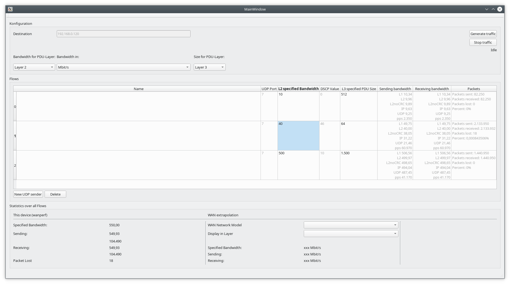

# This is the main repository for project wanperf
wanperf is a multithread application which can be used to measure network performance in a lab environment.
It produces network traffic (UDP) wich is echoed by a sattellite. wanperf calculates banwidth in different network
layers, pps, packet loss.

You can send different flows, for each flow you can set the bandwidth, packet size and DSCP value. Each flow will
be generated in a different thread.

## Warning
With wanperf, it is very easy to produce huge bandwidths with very small packets. It is aimed to be used in a
lab environment in order to test the performance of network devices. DO NOT USE IN PRODUCTION if you don't exactly
know what you are doing. You could disrupt the production environment or at least disturb users.

Please be aware that your few parameters an clicks can produce lots of network traffic. Use at your own risk!

## How to run from source
wanperf is been developped under Debian GNU/Linux. It probably will run on any linux system, maybe on BSD-Systems.
It will not run under Microsoft Windows (until someone ports the code).

udpecho_ebpf will probably only run on linux systems.

Both have not been ported to Windows, and probably won't run there for now.

## sender & satellite
In order to run wanperf, you need a computer with an ethernet NIC as a sender (wanperf itself, which run
as a GUI) and a second computer (satellite) with an ethernet NIC, that echoes the received packets.

## satellite
You need a satellite that echoes UDP datagrams back. You could use any udp echo server, but they probably won't mirror
DSCP and are not very performant (we need Gigbit speed with 64-bytes-packets!).

Unter the folder satellite there is a high performance udp echo wich runs als an ebpf-filter (directly in the kernel).
I have not tested udpecho_ebpf on a small platform as a Raspberry PI yet, but the aim is to be as efficient as possible
in order to have a cheap small satellite hardware.
### Requiremnents
- Python 3
- pyroute2
- BPF Compiler Collection Python 3 libraries (python3-bpfcc)
- Linux kernel > 4.1
- udpecho_ebpf.py has to be run as root as ist inserts an ebpf into the kernel. Use sudo or a root shell.

### Syntax
'''
wanperf/satellites$ ./udpecho_ebpf.py -h
usage: udpecho_ebpf.py [-h] [-p PORT | -r RANGE RANGE] interface

Echo UDP packets, preserve IP- and UDP Headers. Run without optional arguments, it will respond on any UDP port.

positional arguments:
  interface             interface on which to listen

optional arguments:
  -h, --help            show this help message and exit
  -p PORT, --port PORT  port on which to listen
  -r RANGE RANGE, --range RANGE RANGE
                        port range on which to listen
'''

### Example
'''
sudo ./udpecho_ebpf.py enp40s0
'''

### Warnings
Ignore the warnings. They come from the ebpf upstream and will be fixed in a future release.

## sender GUI (wanperf)
### Compile wanperf
Dependency: qt5
'''
$ qmake
$ make
'''

### Run as a normal user
wanperf can be runned as a normal user.
'''
./wanperf
'''

### Screenshot

